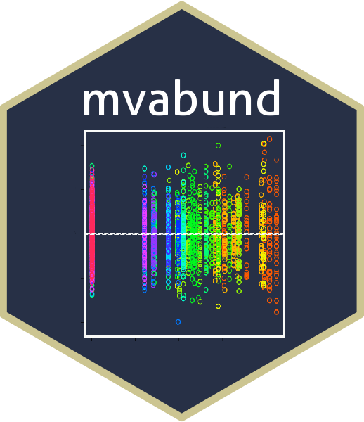

<!-- README.md is generated from README.Rmd. Please edit that file -->

# mvabund 

<!-- badges: start -->

[](https://doi.org/10.1111/j.2041-210X.2012.00190.x)
[](http://www.gnu.org/licenses/gpl-2.0.html)
[](https://CRAN.R-project.org/package=mvabund)
[](https://www.r-pkg.org/pkg/mvabund)
[](https://app.codecov.io/gh/fontikar/mvabund?branch=master)
<!-- badges: end -->

The goal of mvabund is to provide tools for a **model-based approach**
to the analysis of multivariate abundance data in ecology [(Yi Wang et
al. 2012)](https://besjournals.onlinelibrary.wiley.com/doi/10.1111/j.2041-210X.2012.00190.x),
in particular, testing hypotheses about the community-environment
association. Abundance measures include counts, presence/absence data,
ordinal or biomass data.

This package includes functions for **visualising data, fitting
predictive models, checking model assumptions, as well as testing
hypotheses about the community–environment association**.

### Installation

`mvabund` is available on
[CRAN](https://CRAN.R-project.org/package=mvabund) and can be installed
directly in R:

``` r
install.packages("mvabund")

library(mvabund)
```

This is an **archived version** -- you can access the development version of `mvabund`
at [ecostats/mvabund](https://github.com/eco-stats/mvabund).
### mvabund in action

Check out the list of studies that uses `mvabund` in their analyses
[here](https://scholar.google.com.au/scholar?cites=2455431763697722063&as_sdt=2005&sciodt=0,5&hl=en)
